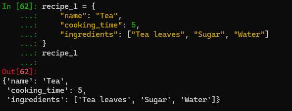
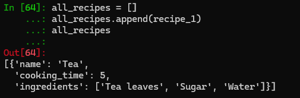
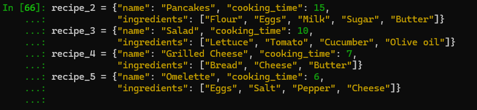
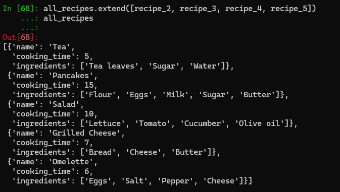
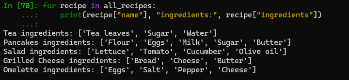
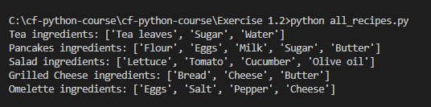

# Exercise 1.2 - Data Types (Task)

This task demonstrates the use of Python data structures to store recipe information.

## Recipe Structure
Each recipe is stored as a **dictionary** with three attributes:
- `name` (string): the recipe name  
- `cooking_time` (int): cooking time in minutes  
- `ingredients` (list of strings): the ingredients  

Dictionaries are ideal here because they let us clearly label and access each attribute by key, making the data both flexible and readable.

## All Recipes Structure
All recipes are stored together inside a **list** called `all_recipes`. A list was chosen because it preserves order, allows easy appending, and supports iteration through all recipes. This makes it convenient to scale the collection as new recipes are added.

## Output

When running `python all_recipes.py` from the command line, the script prints the ingredients for each recipe:

Tea ingredients: ['Tea leaves', 'Sugar', 'Water']
Pancakes ingredients: ['Flour', 'Eggs', 'Milk', 'Sugar', 'Butter']
Salad ingredients: ['Lettuce', 'Tomato', 'Cucumber', 'Olive oil']
Grilled Cheese ingredients: ['Bread', 'Cheese', 'Butter']
Omelette ingredients: ['Eggs', 'Salt', 'Pepper', 'Cheese']

## Screenshots

All steps were completed in IPython (and the script was run from VS Code).  
Screenshots are stored in the `screenshots/` folder.

> Tip (Windows): Press **Win+Shift+S** to capture, then save into `screenshots/`.

### Step 1 — Create `recipe_1`

### Step 2 — Create `all_recipes` and append `recipe_1`

### Step 3 — Create `recipe_2` … `recipe_5`

### Step 4 — Add all recipes to `all_recipes`

### Step 5 — Print ingredients for each recipe

### Step 6 — Script run in VS Code (optional)

## Learning Journal

See my reflections and notes for this exercise:
- [learning-journal.md](../learning-journal.md)
